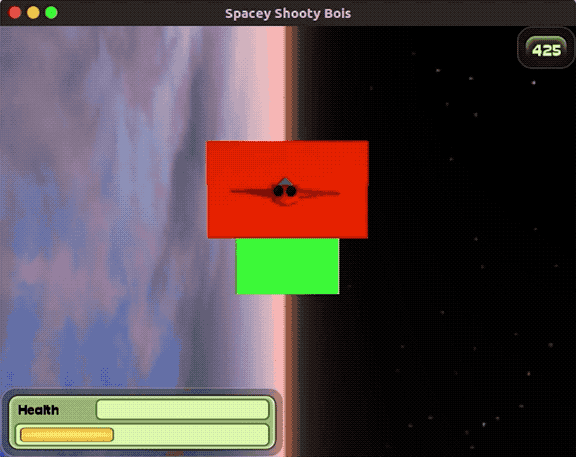

# Final Project

  

The final project for CS381 was to work with a group to create an orignal game using the game engine we had created from basic components. Our final project is a 3D space shooter we called "Spacey Shooty Bois". A gif of gameplay can be seen above.

The game consists of an infinite number of levels where the goal of each level is to make it to the end without dying. Levels get progressively harder until level 10, when the maximum difficulty is reached and all levels after will have the same difficulty. The player earns points by destroying obstacles, killing enemies, and making it to a new level.

## Contributor GitHub Accounts:
* [Kevin Carlos](https://github.com/Kevin-Carlos)
* [Alex Kastanek](https://github.com/AlexKastanek)
* [Bryce Monaco](https://github.com/BryceDMonaco)